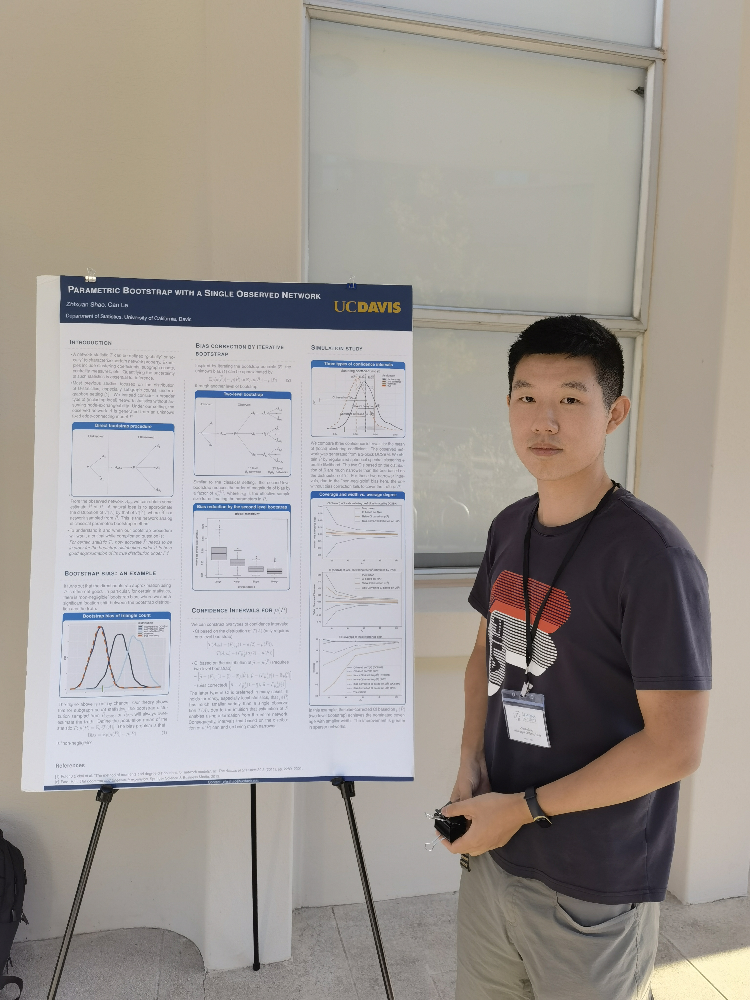

# Zhixuan Shao (邵智轩) @ University of California, Davis

* Email: zhxshao@ucdavis.edu
* Github: <https://github.com/KillingVectorField>

## Education
* **Ph.D. in Statistics**, University of California, Davis.
* **B.S. in Physics**, 2019, Peking University.

## Teaching
* STA 142B--Statistical Learning II (unsupervised learning), Spring 2022, Spring 2023
* STA 231C--High dimensional statistics (PhD level), Spring 2021
* STA 206--Linear statistical models (master level), Fall 2020
* STA 200B--Mathematical Statistics (master level), Winter 2023
* STA 013--Elementary Statistics, Spring 2020, Winter 2021
* STA 032--Gateway to Data Science, Winter 2020
* STA 100--Applied Statistics for Biological Sciences, Fall 2019

## Research Experiences
* **Parametric Bootstrap on Networks**, University of California, Davis, advisor: Prof. Can M. Le | 2021 - 2023
  + Analogue of the classical parametric bootstrap method on random networks
  + Bias reduction and accuracy improvement by a second-level bootstrap
* **Estimating the Number of Communities under Sparsity and Degree Heterogeneity**, University of California, Davis, advisor: Prof. Can M. Le | Ongoing
* **Causal Inference with Outcomes Truncated by Death**, Peking University, supervised by Prof. Xiao-Hua Zhou | Mar 2018 – July 2018
  + Improved the method ([*Wang et al., Identification and estimation of causal effects with outcomes truncated by death, Biometrika, 2017*](https://doi.org/10.1093/biomet/asx034)) with its optimization steps
  + Derived the asymptotic variance of the estimator, which showed good coverage property according to simulation results.
  + Developed an R Package (named [tbd](https://cran.r-project.org/web/packages/tbd/index.html) on CRAN), and applied it to real clinical data.
<!-- * **Causal Structure Learning**, University of Washington, supervised by Prof. Ali Shojaie | July 2018 – Aug 2018 -->
<!--   + Tried to seek the lower bound of the volume of unfaithful distributions when using the [Reduced PC-Algorithm](https://arxiv.org/abs/1806.06209) for causal structure learning -->
<!--   + Considered an alternative “top-down” approach of the Reduced PC-Algorithm
 -->
 
## Internship
* **Tencent IEG, Lightspeed & Quantum Studios Group**, Summer 2021
  + User clustering using community detection and node embedding techniques
  + Stolen accounts detection in PUBG mobile

* **AppLovin**, Summer 2022
  + Hyperparameter tuning on bidder models (offline experiments and A/B testing)
* **Pinterest**, Summer 2023
  + Offline and online experiment with [DHEN](https://arxiv.org/abs/2203.11014) architecture on oCPM models

## Honors
* **Excellent Research Award**, Peking University, Oct 2018
* **Teaching Recognition Award**, University of California, Davis, 2021-2022

## Skills
Proficient in Python, R, Familiar with C++, SQL, Mathematica

## Activities
Statistics in the Big Data Era Workshop, Poster Session, Berkeley, June 2022

